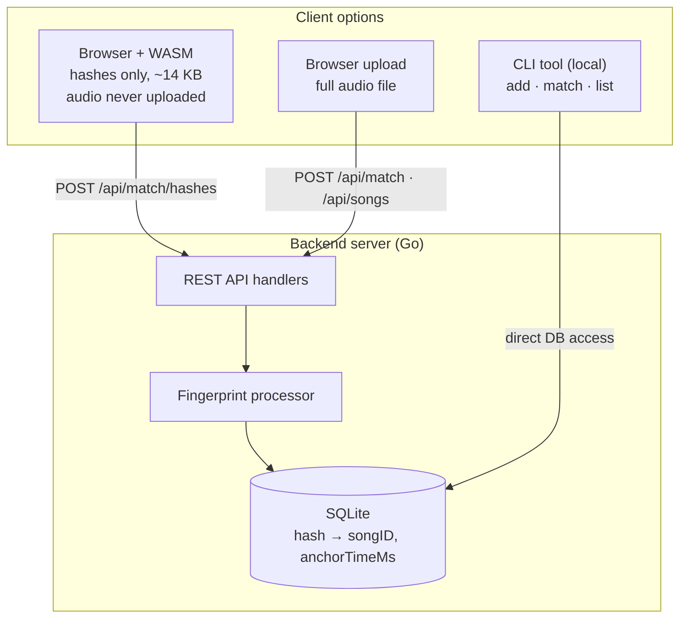
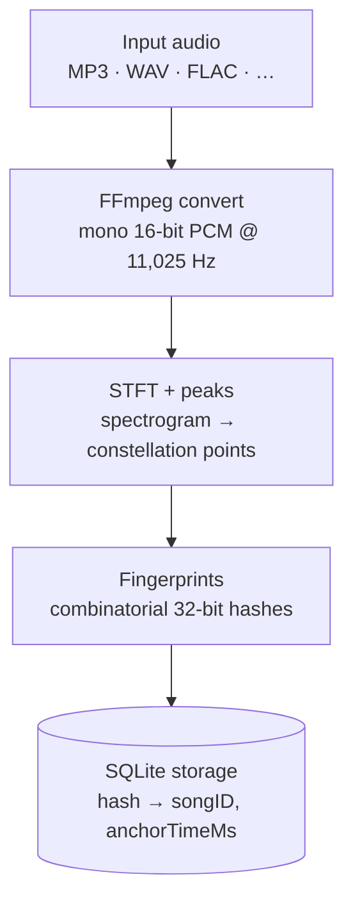
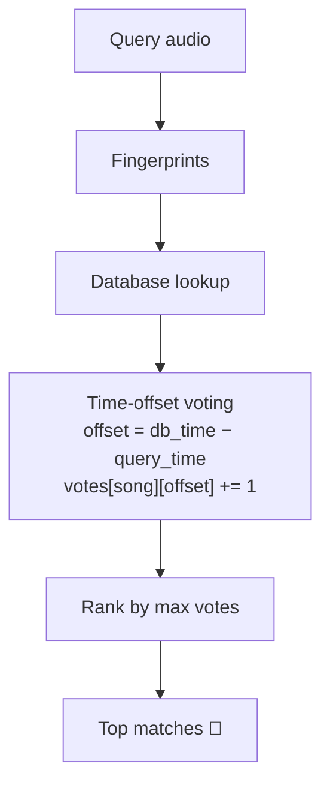

# 🎵 AcousticDNA

[](https://go.dev/)
[](https://webassembly.org/)

**Audio fingerprinting system** built from scratch in Go. Identify songs from short audio clips using Shazam-like algorithms, with optional **client-side WebAssembly processing** for complete privacy.

---

## ✨ Features

- 🎵 **Shazam-Grade Matching** - Identifies songs from 5-15 second clips with background noise
- 🔒 **Privacy-Preserving** - Optional WASM processing keeps audio in browser
- 🎼 **Universal Audio Support** - MP3, WAV, FLAC, AAC, M4A, OGG via FFmpeg
- 📹 **YouTube Integration** - Auto-download and extract metadata from URLs
- 💻 **Multiple Interfaces** - CLI tool, REST API, and WASM web frontend

---

## 🚀 Installation

### Local Installation

**Prerequisites:**

- Go 1.25+ ([Download](https://go.dev/dl/))
- FFmpeg & FFprobe ([Download](https://ffmpeg.org/download.html))
- yt-dlp ([Download](https://github.com/yt-dlp/yt-dlp?tab=readme-ov-file#installation))

```bash
# Clone and build
git clone https://github.com/himanishpuri/AcousticDNA.git
cd AcousticDNA
go mod download

# Build CLI
go build -o acousticDNA ./cmd/cli/

# Build server
go build -o server ./cmd/server/

# Build WASM (optional)
GOOS=js GOARCH=wasm go build -o web/public/fingerprint.wasm ./cmd/wasm/
```

---

## 📖 Usage

### CLI

```bash
# Add song from file
./acousticDNA add song.mp3 --title "Sandstorm" --artist "Darude"

# Add from YouTube
./acousticDNA add --youtube-url "https://youtube.com/watch?v=VIDEO_ID"

# Match audio
./acousticDNA match recording.wav

# List songs
./acousticDNA list

# Delete song
./acousticDNA delete <song-id>
```

### REST API

```bash
# Start server
./server -port 8080

# Add song
curl -X POST http://localhost:8080/api/songs \
  -F "audio=@song.mp3" \
  -F "title=Sandstorm" \
  -F "artist=Darude"

# Match audio
curl -X POST http://localhost:8080/api/match \
  -F "audio=@clip.wav"

# List songs
curl http://localhost:8080/api/songs
```

### WASM Web Interface

```bash
# Serve frontend
cd web/public && python3 -m http.server 8080

# or
cd web && npx serve public

# Open http://localhost:8080
# Upload audio → Generate fingerprint → Match
```

---

## 🏗️ Architecture

### System Overview



### Audio Processing Flow



### Matching Algorithm



---

## 📊 Performance

Measured against the demo database (**91 MB**, ~822K fingerprint rows, 22 songs) with a
real ~15 s query clip (`test/testCroppedAudio/bruatiful_test.wav`, 11,025 Hz mono WAV).
Reproduce via `go test ./pkg/acousticdna -run TestPerfClaims -v`.

| Metric                     | Measured                       | Notes                                                                                                                                                                    |
| -------------------------- | ------------------------------ | ------------------------------------------------------------------------------------------------------------------------------------------------------------------------ |
| **Bandwidth (WASM path)**  | **~98% reduction**             | 3.74 MB raw WAV → ~61 KB hash payload (3,795 hashes). Only fingerprint hashes cross the wire; audio never leaves the browser.                                            |
| **Query fingerprint size** | ~3.8K hashes / clip            | Compact `uint32` hashes + anchor times.                                                                                                                                  |
| **DB retrieval**           | single batched `hash IN (...)` | One indexed round trip (`idx_hash`) replaces N per-hash queries — ~3× faster locally on this DB, and the gap widens with network round-trip latency and larger catalogs. |
| **Match latency**          | sub-second                     | Full match (retrieval + offset voting) over 822K rows completes in well under a second.                                                                                  |

> Bandwidth reduction scales with clip length and source format — a longer or lossless
> source pushes it higher; the number above is for this specific test clip.

---

## 🔬 How It Works

### 1. Audio Preprocessing

- Convert any audio format to **mono 16-bit PCM WAV @ 11,025 Hz** using FFmpeg
- Normalize sample rate for consistent fingerprint generation

### 2. Spectrogram Generation (STFT)

- **Window Size**: 1024 samples (~93ms)
- **Hop Size**: 256 samples (75% overlap)
- **Window Function**: Hamming window
- **Frequency Resolution**: ~10.77 Hz/bin

### 3. Peak Extraction

- Identify spectral peaks (constellation points) in time-frequency space
- Filter by intensity threshold and local maxima
- Each peak represents a significant acoustic event

### 4. Combinatorial Hashing

- Pair anchor peaks with target peaks within time window
- Generate 32-bit hash: `[anchorFreq(9) | targetFreq(9) | deltaTime(14)]`
- Store hash with precise anchor timestamp

### 5. Time-Coherence Voting

- Query hashes against database (batch SQL query for 10-100x speedup)
- Calculate time offsets: `offset = db_time - query_time`
- Vote for song/offset pairs
- Return matches ranked by vote count (confidence score)

### Spectrogram Visualization

Example spectrogram of "Sandstorm" by Darude:


_Frequency vs. Time representation showing spectral characteristics. Brighter regions indicate higher energy._

---

## 🔗 Integrations

### YouTube Integration

- **Auto-download** videos using yt-dlp
- **Auto-extract** metadata (title, artist) from video info
- **Audio extraction** from video containers

```bash
# CLI
./acousticDNA youtube "https://youtube.com/watch?v=dQw4w9WgXcQ"

# API
curl -X POST http://localhost:8080/api/songs/youtube \
  -H "Content-Type: application/json" \
  -d '{"youtube_url": "https://youtube.com/watch?v=dQw4w9WgXcQ"}'
```

### FFmpeg Integration

- **Format conversion**: MP3, WAV, FLAC, AAC, M4A, OGG, etc.
- **Metadata extraction**: Duration, sample rate, channels
- **Audio normalization**: Consistent 11,025 Hz mono output

### WebAssembly Integration

- **Client-side processing**: Audio fingerprinting in browser
- **Privacy preservation**: Only hashes sent to server (not audio)
- **Bandwidth optimization**: 14 KB vs 3 MB (99.5% reduction)

---

## ⚙️ Configuration

### Environment Variables

| Variable            | Default               | Description                                          |
| ------------------- | --------------------- | ---------------------------------------------------- |
| `ACOUSTIC_DB_PATH`  | `acousticdna.sqlite3` | SQLite database file path                            |
| `ACOUSTIC_TEMP_DIR` | `/tmp`                | Temporary file directory                             |
| `PORT`              | `8080`                | HTTP server port (overridden by `-port` flag if set) |

### CLI Flags

**Server:**

```bash
./server \
  -port 8080 \
  -db acousticdna.sqlite3 \
  -temp /tmp \
  -rate 11025 \
  -origins "*"
```

### DSP Parameters

| Parameter           | Value        | Description                  |
| ------------------- | ------------ | ---------------------------- |
| **Sample Rate**     | 11,025 Hz    | Optimized for fingerprinting |
| **Bit Depth**       | 16-bit PCM   | Signed integer format        |
| **Channels**        | Mono         | Stereo averaged to mono      |
| **Window Size**     | 1024 samples | STFT frame length            |
| **Hop Size**        | 256 samples  | 75% overlap                  |
| **Window Function** | Hamming      | 0.54 - 0.46×cos(2πn/(N-1))   |

---

## 📊 Performance

### Matching Speed

| Database Size | Hashes/Query | Query Time | Accuracy |
| ------------- | ------------ | ---------- | -------- |
| 100 songs     | ~10,000      | 50-100ms   | 95%+     |
| 1,000 songs   | ~10,000      | 200-400ms  | 90%+     |
| 10,000 songs  | ~10,000      | 1-2s       | 85%+     |

### Audio Processing

| Duration | Samples   | Hashes  | Processing Time |
| -------- | --------- | ------- | --------------- |
| 10s      | 441,000   | ~1,200  | 500-800ms       |
| 30s      | 1,323,000 | ~3,600  | 1.5-2.5s        |
| 3min     | 7,938,000 | ~21,600 | 8-12s           |

### Batch Hash Retrieval Optimization

- **Old (N queries)**: 10,000 hashes × 2ms = **20 seconds**
- **New (1 query)**: 10,000 hashes = **50-200ms**
- **Improvement**: **10-100x faster**

### Privacy-Preserving Mode

- **Traditional upload**: 3 MB audio file
- **WASM hash upload**: 14 KB hashes
- **Bandwidth reduction**: **99.5%**

---

## 🏢 Project Structure

```
├── acousticdna.sqlite3          # Fingerprint database (tracked via Git LFS)
├── Dockerfile                   # Multi-stage build (static ffmpeg + yt-dlp)
├── docker-compose.yml           # Run: docker compose up
├── docker-compose.prod.yml      # Hardened overlay (read-only, cap-drop)
├── .dockerignore
├── .gitattributes               # Git LFS tracking (*.sqlite3)
├── CLAUDE.md                    # Guidance for AI coding agents
├── cmd
│   ├── cli
│   │   └── main.go              # Terminal commands (add/match/list)
│   ├── server
│   │   ├── handlers.go          # What happens when API called
│   │   ├── main.go              # Starts the HTTP server
│   │   ├── main_test.go
│   │   ├── routes.go            # Maps URLs to handlers
│   │   └── routes_test.go
│   └── wasm
│       └── main.go              # Runs in browser
├── go.mod
├── go.sum
├── pkg
│   ├── acousticdna
│   │   ├── audio
│   │   │   ├── processor.go     # Converts audio via FFmpeg + yt-dlp download
│   │   │   ├── processor_test.go
│   │   │   └── reader.go        # Reads WAV files
│   │   ├── config.go            # App settings (functional options)
│   │   ├── fingerprint
│   │   │   ├── generator.go     # Orchestrates fingerprinting + voting
│   │   │   ├── generator_test.go
│   │   │   ├── hasher.go        # Creates 32-bit hashes from peaks
│   │   │   ├── peaks.go         # Finds peaks in spectrum
│   │   │   └── spectrogram.go   # STFT time-frequency map
│   │   ├── interfaces.go        # Service + Storage contracts
│   │   ├── service.go           # Main business logic
│   │   ├── service_test.go
│   │   ├── storage
│   │   │   └── sqlite.go        # gorm + SQLite persistence
│   │   └── storage_adapter.go   # Bridges DBClient to Storage interface
│   ├── logger
│   │   └── logger.go            # Logging helper
│   ├── models
│   │   ├── api.go               # HTTP request/response DTOs
│   │   ├── database.go          # Couple / Match domain types
│   │   └── domain.go            # Song / MatchResult
│   └── utils
│       ├── files.go             # File operations
│       ├── uuid.go              # UUID v4 generator
│       └── youtube.go           # YouTube URL parsing
├── README.md
├── refrence_scripts             # Standalone examples (//go:build ignore)
│   ├── download_yt.go
│   └── make-spectorgram.go
├── scripts
│   └── build-wasm.sh            # Compiles to WebAssembly
├── test/                        # Sample audio + spectrograms
└── web
    ├── public
    │   ├── fingerprint.wasm     # Browser-side processor
    │   ├── index.html           # Web interface (single file)
    │   ├── wasm_exec.js         # Go's WASM glue code
    │   └── wasm.js              # Loads + drives the WASM module
    └── src
        └── api
            └── wasm.js          # (legacy JS wrapper)
```

---

## 🎓 Technical Highlights

### Algorithm Implementation

- Custom STFT implementation with Hamming windowing
- Combinatorial hash generation from spectral peaks
- Time-coherence voting for robust matching
- Batch SQL optimization for hash retrieval

### Privacy Design

- Optional client-side processing via WebAssembly
- Only cryptographic hashes transmitted to server
- Server cannot reconstruct original audio from hashes

### Engineering Practices

- Clean architecture with interface-based design
- Comprehensive error handling and logging
- Context-based timeout management

---

## 🐛 Troubleshooting

**"No peaks found in audio"**

- Audio is too quiet or silent
- Try normalizing audio volume
- Ensure audio is at least 5-15 seconds long

**"WASM initialization failed"**

- Run `./scripts/build-wasm.sh` to build WASM module
- Ensure `fingerprint.wasm` exists in `web/public/`

**CORS errors in browser**

- Set server `-origins` flag: `./server -origins "http://localhost:3000"`

**Database locked**

- SQLite allows only one writer at a time
- Wait for current operation to complete

## 📚 References

- [Audio Fingerprinting Research Paper](https://hajim.rochester.edu/ece/sites/zduan/teaching/ece472/projects/2019/AudioFingerprinting.pdf)
- [Acoustic Fingerprint - Wikipedia](https://en.wikipedia.org/wiki/Acoustic_fingerprint)
- [STFT Tutorial - Stanford CCRMA](https://ccrma.stanford.edu/~jos/sasp/Short_Time_Fourier_Transform.html)
- [Shazam's Original Patent](https://patents.google.com/patent/US6990453B2/)

---

<div align="center">

**⭐ Star this repo if you find it useful!**

Made with ❤️ by [Himanish Puri](https://github.com/himanishpuri)

</div>
